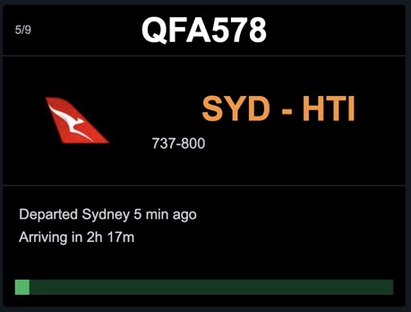

# TheFlightWall Firmware — CYD Edition

PlatformIO firmware for the CYD (TFT) variant of TheFlightWall. The current root-level project targets ESP32 "Cheap Yellow Display" boards rather than the original LED matrix build.

Current release: **v0.13.0** (25 May 2026)

> 
> *Placeholder — front-on photo of the CYD displaying a flight card: callsign top-left, airline logo left column, IATA route in amber, progress bar at the bottom.*

---

## Current status

- Default build target: `cyd_320x240`
- Verified build: `platformio run` / `/Users/anthonyjclarke/.platformio/penv/bin/platformio run`
- WiFi provisioning: WiFiManager captive portal named **FlightWall-Setup**
- Flight position source: OpenSky Network OAuth2 REST API
- Flight route/aircraft enrichment: FlightAware AeroAPI
- Friendly airline/aircraft display names: FlightWall CDN JSON lookup files
- Airline logos: Jxck-S/airline-logos via the images.weserv.nl PNG→JPEG proxy, cached in LittleFS
- Display behaviour: cached flight list cycles independently of the network fetch interval
- Web dashboard: browser-rendered TFT mirror, volatile live feed, enriched-flight detail panel, runtime configuration
- Diagnostic output: local Australia/Sydney timestamps after NTP sync; `[boot +Ns]` before sync
- Live no-extra-cost metrics from OpenSky: distance, bearing, altitude/flight level, speed, heading, climb/descent, ground state

---

## What it does

- Fetches nearby ADS-B state vectors from OpenSky Network using OAuth2 and a bounding-box query around your configured location.
- Enriches callsigns with route, aircraft type and operator details via FlightAware AeroAPI, selecting the live record from any historical/future legs returned for the same callsign.
- Looks up friendly airline and aircraft display names from the FlightWall CDN.
- Caches airline logo JPEGs on LittleFS, fetched from the Jxck-S/airline-logos repository via a PNG→JPEG image proxy.
- Renders cycling flight cards on CYD TFT displays.
- Serves an embedded operational dashboard at the device IP address.
- Keeps an in-memory 50-entry scrolling log of the latest fetch results.
- Shows live ADS-B metrics without adding API cost: distance/cardinal bearing, altitude or flight level, speed, heading, climb/descent, ground state.

> 
> *Placeholder — block diagram: OpenSky `/states/all` → `FlightDataFetcher` → AeroAPI `/flights/{ident}` → FlightWall CDN name lookup → CYDDisplay + WebUIServer.*

---

## Key components

| Path | Role |
|:-----|:-----|
| `src/main.cpp` | Entry point — WiFiManager provisioning, millis-based fetch loop, reboot scheduling |
| `src/core/FlightDataFetcher` | Orchestrates: state vectors → flight metadata → name enrichment → ADS-B fallback cards |
| `src/adapters/OpenSkyFetcher` | OpenSky OAuth2, bounding-box query, distance/bearing filter |
| `src/adapters/AeroAPIFetcher` | AeroAPI `/flights/{ident}` — route, aircraft, operator, ISO 8601 → UTC timing |
| `src/adapters/FlightWallFetcher` | CDN airline/aircraft display-name lookup; cached LittleFS logo retrieval |
| `src/adapters/CYDDisplay` | TFT_eSPI flight card — callsign, route, status lines, progress bar, JPEG logo |
| `src/adapters/WebUIServer` | HTTP server (port 80) — dashboard, JSON API, logo serving, runtime configuration |
| `src/config/` | `UserConfiguration`, `APIConfiguration`, `TimingConfiguration`, `HardwareConfiguration`, `RuntimeConfig` |
| `src/interfaces/` | `BaseDisplay`, `BaseFlightFetcher`, `BaseStateVectorFetcher` |
| `src/models/` | `FlightInfo`, `StateVector`, `AirportInfo` |
| `src/utils/GeoUtils.h` | Haversine distance and bearing calculations |
| `include/debug.h` | Leveled, locally timestamped macros: `DBG_ERROR` / `DBG_WARN` / `DBG_INFO` / `DBG_VERBOSE` |

---

## Quick-start

```bash
cp include/secrets.h.template include/secrets.h
```

Fill in `include/secrets.h`:

```cpp
#define SECRET_OPENSKY_CLIENT_ID     "your-opensky-api-client-id"
#define SECRET_OPENSKY_CLIENT_SECRET "your-opensky-api-client-secret"
#define SECRET_AEROAPI_KEY           "your-flightaware-aeroapi-key"
```

Then set your location in `src/config/UserConfiguration.h` (or leave the defaults and override at runtime via the WebUI), select your environment in PlatformIO, and upload:

- `cyd_320x240` — ESP32-2432S028R (ILI9341, standard CYD)
- `cyd_480x320` — ESP32-3248S035R (ST7796, larger CYD)

On first boot the device opens an AP named **FlightWall-Setup** — connect from any device and enter your WiFi credentials.

> 
> *Placeholder — captive-portal page titled "FlightWall-Setup" with a list of nearby SSIDs and a password field.*

---

## Display output

Each flight card is styled to match the commercial FlightWall product display. Layout (320×240, landscape):

| Zone | Content |
|:-----|:--------|
| Top bar | Large callsign centered; card position (`3/11`) at left |
| Airline column (left ~118 px) | Cached JPEG airline logo (`/logos/{CODE}.jpg`) if available; airline display name in white as fallback |
| Route column (right) | IATA origin → destination in amber (`LAX-JFK`); ICAO fallback when IATA is absent |
| Aircraft row | Aircraft type short name (e.g. `737-800`) |
| Status row 1 | "Departed Sydney 45 min ago" — once NTP sync is confirmed and AeroAPI returned a departure |
| Status row 2 | "Arriving at Melbourne in 4h 30m" or "Arrived at Melbourne" |
| Progress bar | Green fill proportional to elapsed flight time; hidden until NTP sync |
| ADS-B fallback row(s) | When enrichment is absent: `15km NE`, altitude / flight-level, speed, heading, climb/descent |

When AeroAPI enrichment is unavailable for a flight (rate-limited, no current record, no API key, or invalid callsign), the card still displays using live ADS-B data only: ident, altitude, speed, heading, distance and bearing. Route and status lines are omitted for ADS-B-only cards.

The display cycle is independent of network fetching. If a fetch is slow, rate-limited, or returns no results, the display keeps cycling the last good flight list rather than freezing or blanking.

> 
> *Placeholder — close-up of an enriched card: airline logo, IATA route in amber, "Arriving at Melbourne in 1h 23m", progress bar partially filled.*

> 
> *Placeholder — fallback card with callsign at top, live metrics row at the bottom, no logo or status lines.*

### Airline brand colour

Earlier releases used a `brand_color_hex` field returned by the FlightWall CDN to render the airline name in its livery colour. The CDN response no longer carries this field; the brand-colour code path is retained as dead code so airline names currently render in white (`COLOR_AIRLINE`). The cached JPEG logo, when present, is the primary visual airline cue.

---

## Web dashboard

Once WiFi is connected, open `http://<device-ip>/` in a browser. The dashboard is embedded in firmware as a single `PROGMEM` HTML/JS blob with no external dependencies and polls the device's JSON endpoints.

| Panel | Behaviour |
|:------|:----------|
| TFT Mirror | Browser-rendered replica of the currently selected display card, synchronised with the card index shown on the TFT. Renders from JSON, not from a framebuffer readback, to avoid extra SPI and network overhead. Logos are fetched via `GET /api/logo?name=...`. |
| Flight Data Feed | Scrolling feed of fetch-cycle events and live aircraft observations. Stores up to 50 entries in RAM only; clears on reboot. |
| Enriched Flight Intelligence | Up to five currently enriched flights with route, operator, aircraft, schedule and extended ADS-B fields that do not fit on the TFT. |
| Device Configuration | Runtime location, timing, brightness and API credential updates stored in NVS with save-and-reboot behaviour. |

Dashboard endpoints:

| Endpoint | Purpose |
|:---------|:--------|
| `GET /` | Embedded dashboard application (HTML in `WebUIServer.cpp` as `HTML_PAGE` PROGMEM blob) |
| `GET /api/live` | Current screen selection, up-to-five enriched flights, volatile activity feed, last-fetch epoch |
| `GET /api/logo?name=<file>.jpg` | Cached LittleFS airline logo image for the dashboard mirror |
| `GET /api/config` | Non-sensitive runtime configuration; `opensky_configured` and `aero_configured` boolean flags only |
| `POST /api/config` | Persist runtime settings; blank credential fields preserve the stored value. Sets a reboot flag handled by `main.cpp`. |

Credentials are write-only in the WebUI: stored OpenSky secrets and AeroAPI keys are never returned by `GET /api/config`.

> 
> *Placeholder — full-page screenshot showing TFT Mirror at top-left, Activity Feed scrolling on the right, Enriched Flights panel below the mirror, Device Configuration form at the bottom.*

> 
> *Placeholder — close-up of the Device Configuration panel with latitude, longitude, radius, fetch interval, cycle duration, brightness, OpenSky / AeroAPI credential fields and a Save & Reboot button.*

---

## API authorisations

The firmware uses three network data sources:

| Service | Used for | Credential needed | Config field |
|:--------|:---------|:------------------|:-------------|
| OpenSky Network REST API | Nearby live ADS-B state vectors from `/api/states/all` | OAuth2 API client ID and secret | `SECRET_OPENSKY_CLIENT_ID`, `SECRET_OPENSKY_CLIENT_SECRET` |
| FlightAware AeroAPI | Route, origin/destination, operator and aircraft metadata for each callsign | AeroAPI key | `SECRET_AEROAPI_KEY` |
| FlightWall CDN | Friendly airline and aircraft display-name lookups | None | No secret required |
| images.weserv.nl + Jxck-S/airline-logos | Airline logo PNG fetch, PNG→JPEG conversion, resize; cached to LittleFS | None | No secret required |

Never commit `include/secrets.h`. It is intentionally gitignored; commit only `include/secrets.h.template`.

### OpenSky Network

This project uses OpenSky's REST API with OAuth2 client credentials. OpenSky no longer accepts website username/password basic auth for the REST API; you need an API Client from your OpenSky account.

1. Create or sign in to an OpenSky account:
   <https://opensky-network.org/my-opensky/account>
2. Open the account page and find the **API Client** card.
3. Create a new API client if one does not already exist.
4. Copy the generated `client_id` and `client_secret` into `include/secrets.h`:

```cpp
#define SECRET_OPENSKY_CLIENT_ID     "xxxxxxxx-api-client"
#define SECRET_OPENSKY_CLIENT_SECRET "xxxxxxxx"
```

At runtime `OpenSkyFetcher` exchanges those values for a bearer token at:

```text
https://auth.opensky-network.org/auth/realms/opensky-network/protocol/openid-connect/token
```

The firmware sends:

```text
grant_type=client_credentials
client_id=<SECRET_OPENSKY_CLIENT_ID>
client_secret=<SECRET_OPENSKY_CLIENT_SECRET>
```

The returned access token is cached and refreshed automatically with a 60-second safety margin. If OpenSky returns `401 Unauthorized`, the firmware refreshes the token once and retries the state-vector request.

The state-vector request is a bounding-box query around runtime-configured centre latitude, centre longitude and radius (falling back to `UserConfiguration` defaults):

```text
https://opensky-network.org/api/states/all?lamin=...&lamax=...&lomin=...&lomax=...
```

Both the token POST and the state-vector GET use a 15 s HTTP timeout (`http.setTimeout(15000)`); the previous 5 s default produced `-11 HTTPC_ERROR_READ_TIMEOUT` on slow responses.

OpenSky API credits are limited. Current OpenSky documentation lists `/states/all` as credit-metered, with standard authenticated users receiving a daily credit allocation and small bounding-box requests costing fewer credits than global requests. Keep `RADIUS_KM` tight and set `FETCH_INTERVAL_SECONDS` conservatively for always-on devices.

Useful OpenSky references:

- REST API docs: <https://openskynetwork.github.io/opensky-api/rest.html>
- OpenSky FAQ auth section: <https://opensky-network.org/about/faq>
- Account/API Client page: <https://opensky-network.org/my-opensky/account>

### FlightAware AeroAPI

AeroAPI is used after OpenSky returns nearby aircraft. For each accepted callsign, `AeroAPIFetcher` calls:

```text
GET https://aeroapi.flightaware.com/aeroapi/flights/{ident}
```

The key is sent as the `x-apikey` header. To get a key:

1. Go to FlightAware AeroAPI:
   <https://www.flightaware.com/commercial/aeroapi>
2. Choose a tier appropriate for your use. FlightAware lists usage-based pricing and a small free monthly credit; confirm the current pricing before running an always-on device.
3. Open the AeroAPI developer portal after signup:
   <https://www.flightaware.com/aeroapi/portal/>
4. Copy your API key into `include/secrets.h`:

```cpp
#define SECRET_AEROAPI_KEY "your-aeroapi-key"
```

Every enriched flight can cost an AeroAPI request. The fetcher caps requests at `MAX_AEROAPI_CALLS_PER_CYCLE` (default 5) per cycle; state vectors are already distance-sorted, so the five closest aircraft are always preferred. Reduce AeroAPI usage by increasing `FETCH_INTERVAL_SECONDS`, reducing `RADIUS_KM`, or temporarily leaving `SECRET_AEROAPI_KEY` blank while testing OpenSky and display behaviour.

The firmware parses only the fields it needs from the AeroAPI response to reduce ESP32 heap pressure. Large AeroAPI responses previously caused ArduinoJson `NoMemory` parse errors; the current parser uses a `Filter` with a 768-byte filter document and a 16 384-byte main document, and uses `http.getString()` rather than `http.getStream()` to avoid a known zero-byte-delivery quirk in ESP32-Arduino 3.x `WiFiClientSecure`.

An AeroAPI callsign can return historical and future records as well as the live flight. The firmware selects only a record whose timing is plausible for an aircraft currently visible to OpenSky: an in-progress flight, a flight that arrived within the last 30 minutes, or a bounded no-arrival-time case (departed within 20 hours). Historical records — for example a departure more than 70 hours old — are rejected and the aircraft remains visible as an ADS-B-only card instead of displaying a false route.

Timestamps returned by AeroAPI carry timezone offsets (e.g. `2026-05-25T08:00:00+10:00` for an AEST departure). `parseIso8601` reads the calendar fields, subtracts the `+HH:MM` / `-HH:MM` offset and returns a true UTC epoch, independent of the system local timezone configured for debug output.

`HTTP 429` means the AeroAPI key is valid but the account is being rate-limited or has exhausted quota. The firmware will continue displaying the last successful flight list, but fewer new flights may be enriched until quota recovers.

Useful AeroAPI references:

- AeroAPI product and pricing page: <https://www.flightaware.com/commercial/aeroapi>
- AeroAPI developer portal: <https://www.flightaware.com/aeroapi/portal/>
- FlightAware AeroAPI help: <https://support.flightaware.com/hc/en-us/sections/32586090657175-AeroAPI>

### FlightWall CDN lookups

`FlightWallFetcher` retrieves friendly airline and aircraft display names from the FlightWall CDN:

```text
GET https://cdn.theflightwall.com/oss/lookup/airline/{ICAO}.json
GET https://cdn.theflightwall.com/oss/lookup/aircraft/{ICAO}.json
```

Current response shape (verified May 2026):

```json
{ "icao": "QFA", "display_name_full": "Qantas" }
```

```json
{ "icao": "B738", "display_name_full": "Boeing 737-800", "display_name_short": "737-800" }
```

No authorisation is required. These calls only add friendly display names. If a lookup fails or returns a code without metadata, the display can still use the operator code or aircraft code returned by AeroAPI.

The CDN no longer returns a `brand_color_hex` field; airline names render in white (`UserConfiguration::COLOR_AIRLINE`) when no cached JPEG logo is available.

### Airline logos (Jxck-S/airline-logos)

Airline logos are fetched from the public [Jxck-S/airline-logos](https://github.com/Jxck-S/airline-logos) GitHub repository (`flightaware_logos/` directory, ~1 800 airlines by ICAO code). PNGs are converted to JPEG and resized to `AIRLINE_LOGO_W × AIRLINE_LOGO_H` (80 × 80) by the `images.weserv.nl` proxy in a single request, then cached to LittleFS as `/logos/{CODE}.jpg`.

ICAO is tried first; if that fails the IATA code is tried (Qantas is ICAO `QFA` but indexed as IATA `QF` in the repo). Subsequent boots serve the cached file directly from LittleFS with no network call.

### OpenSky-only metrics

The following fields are taken from the OpenSky `/states/all` response and therefore do not add AeroAPI calls:

| Field | Display use |
|:------|:------------|
| `distance_km` | Distance from configured centre point |
| `bearing_deg` | Cardinal direction from configured centre point |
| `baro_altitude` / `geo_altitude` | Altitude or flight level |
| `velocity` | Ground speed in km/h |
| `heading` | Track/heading in degrees |
| `vertical_rate` | `UP` / `DN` climb/descent indicator |
| `on_ground` | `GROUND` status |
| `icao24`, `time_position`, `last_contact` | Identity and observation timing (dashboard detail view) |
| `latitude`, `longitude` | Last live position (dashboard detail view) |
| `squawk`, `position_source` | Transponder/source detail (dashboard detail view) |

### Testing credentials

Use `DEBUG_LEVEL=3` or `DEBUG_LEVEL=4` in `platformio.ini` while bringing up credentials. Useful serial messages:

- `[YYYY-MM-DD HH:MM:SS] [INFO] ...` confirms NTP synchronisation and local timezone (Australia/Sydney); before sync, messages use `[boot +Ns]`.
- `RuntimeConfig APIs: OpenSky=configured AeroAPI=configured` confirms credentials are populated without logging their values.
- `OpenSky: query center=... radius=... bbox=...` and `OpenSky: raw states=... in_radius=...` confirm the requested region and filter result.
- `FlightData: states=... cards=... aero_calls=... enriched=...` distinguishes missing live aircraft from missing enrichment.
- `OpenSky: token obtained` means OAuth succeeded.
- `OpenSky: token POST failed` usually means the OpenSky client ID/secret is wrong, missing, or copied from the wrong OpenSky interface.
- `OpenSky: HTTP GET failed, code: -11` is a read timeout — see the 15 s timeout note above.
- `AeroAPI: no API key configured` means `SECRET_AEROAPI_KEY` is blank or `include/secrets.h` was not found.
- `AeroAPI: HTTP 401` or `403` usually means the AeroAPI key is invalid, disabled or not authorised for the endpoint.
- `AeroAPI: HTTP 429` indicates rate limiting or exhausted quota.
- `AeroAPI: <ident> no active match in N records` means live ADS-B was received but all route records were stale; the ADS-B-only card remains available.
- `AeroAPI: <ident> dep="..." epoch=... delta=...min` confirms timestamp parsing and the selected record's departure delta from now.

If `include/secrets.h` exists but credentials still appear blank, check that it is under `include/`, not the project root, and that each `#define` is above any accidental `#ifdef` or comment block.

---

## Notes

- OpenSky OAuth token is managed automatically with a 60-second refresh skew.
- AeroAPI enrichment runs per-callsign; each unique flight costs at most one API call per fetch cycle, capped at five total calls per cycle.
- `FETCH_INTERVAL_SECONDS` controls OpenSky polling and downstream enrichment frequency; tune for your API quotas.
- `DISPLAY_CYCLE_SECONDS` controls how long each cached flight card stays on screen.
- Debug output is controlled via the `-DDEBUG_LEVEL=N` build flag (default 3 = INFO) and switches to local Australia/Sydney timestamps after NTP sync.
- LittleFS is initialised at boot with `LittleFS.begin(true)` — the partition is formatted on first boot.

---

## Acknowledgements

This firmware is derived from and inspired by the commercial [TheFlightWall](https://theflightwall.com) product. The CYD edition is an independent open-source reimplementation; it is not affiliated with or endorsed by TheFlightWall.

### Libraries

| Library | Author | Licence | Purpose |
|:--------|:-------|:--------|:--------|
| [TFT_eSPI](https://github.com/Bodmer/TFT_eSPI) | Bodmer | MIT | TFT display driver and graphics primitives |
| [TJpg_Decoder](https://github.com/Bodmer/TJpg_Decoder) | Bodmer | MIT | On-device JPEG decode and render via TJpgDec |
| [WiFiManager](https://github.com/tzapu/WiFiManager) | tzapu | MIT | Captive-portal WiFi provisioning |
| [ArduinoJson](https://github.com/bblanchon/ArduinoJson) | Benoît Blanchon | MIT | JSON parsing for all API responses (v6) |

### Data and asset sources

| Source | URL | Used for |
|:-------|:----|:---------|
| OpenSky Network | <https://opensky-network.org> | Live ADS-B state vectors |
| FlightAware AeroAPI | <https://www.flightaware.com/commercial/aeroapi> | Flight route and operator enrichment |
| FlightWall CDN | <https://cdn.theflightwall.com> | Airline and aircraft friendly display names |
| Jxck-S/airline-logos | <https://github.com/Jxck-S/airline-logos> | Airline logo PNG images (~1 800 airlines by ICAO code) |
| images.weserv.nl | <https://images.weserv.nl> | PNG→JPEG conversion and resize proxy; result cached to LittleFS on first fetch |
