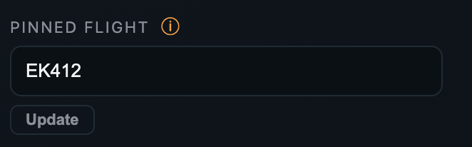
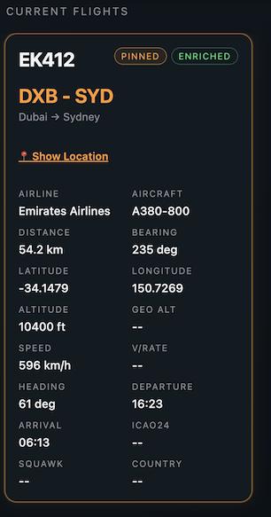

<div align="center">

<picture>
  <source media="(prefers-color-scheme: dark)" srcset="assets/branding/logo_transparent_720x160-2x.png">
  
</picture>

**ESP32 flight tracker for the "Cheap Yellow Display"** &middot; live ADS-B, AeroAPI route enrichment, embedded dashboard

[](https://github.com/anthonyjclarke/TheFlightWall_CYD/releases)
[](LICENSE)
[](https://github.com/anthonyjclarke/TheFlightWall_CYD/commits)
[](#appendix-a--hardware-background-the-cheap-yellow-display)
[](https://platformio.org/)
[](https://www.arduino.cc/)

</div>

---

# TheFlightWall — CYD Edition

PlatformIO firmware for the CYD (TFT) build target of [TheFlightWall OSS](https://github.com/AxisNimble/TheFlightWall_OSS) — the open-source flight wall project by [AxisNimble](https://github.com/AxisNimble). This repository implements the ESP32 "Cheap Yellow Display" hardware variant of that project using either 320×240 or 480×320 models.

> New to the CYD? See [Appendix A — Hardware background](#appendix-a--hardware-background-the-cheap-yellow-display) at the end of this document for board variants, where to buy, 3D-printable cases and community resources.

> First-time builder? [Appendix B — Complete build and flash guide](#appendix-b--complete-build-and-flash-guide) walks you step by step from cloning the repository through to a working device, covering tool setup, every API credential, location configuration, and first-boot WiFi provisioning.

**What this edition adds over the base OSS spec:**

- **TFT display** — ILI9341 / ST7796 driver via TFT_eSPI; cycling flight cards with callsign, route, status lines, elapsed-time progress bar and cached airline logo
- **Google Maps card** — road-map JPEG fetched from the Google Maps Static API, cached 24 h on LittleFS, with all tracked aircraft overlaid as dots with heading ticks and labels
- **AeroAPI enrichment** — per-callsign route, origin/destination, operator and ISO 8601 timing data from FlightAware AeroAPI; graceful ADS-B-only fallback when unavailable
- **Airline branding** — friendly display names from the FlightWall CDN; logo JPEGs fetched via images.weserv.nl and cached permanently in LittleFS
- **Embedded web dashboard** — browser-rendered TFT mirror, scrolling activity feed, enriched-flight detail panel and runtime configuration form served from the device
- **Pinned flight tracking** — nominate a flight number (e.g. `QF1`) in the dashboard; it is tracked every cycle regardless of radar radius and pinned as the first card, with an amber header on the TFT, a `PINNED` badge and Google Maps location link in the WebUI, and a bearing-arrow indicator on the map card when the flight is out of range
- **Runtime configuration** — location, radius, fetch interval, display timing, brightness, label colour and API credentials persisted to NVS via the dashboard; **all settings apply live with no reboot** (a separate *Reboot Device* button is retained for WiFi reset / recovery); no reflash needed
- **WiFiManager provisioning** — captive-portal AP on first boot; credentials stored in NVS

Current release: **v1.4.0** (01 June 2026) · canonical version: `FW_VERSION_STR` in `src/config/Version.h`

> 
> 
> *TheFlightWall CYD running live — enriched flight cards cycling on the ILI9341 320×240 TFT.*

---

## Current status

- Default build target: `cyd_320x240`
- Verified build: `platformio run`
- WiFi provisioning: WiFiManager captive portal named **FlightWall-Setup**
- Flight position source: OpenSky Network OAuth2 REST API
- Flight route/aircraft enrichment: FlightAware AeroAPI
- Friendly airline/aircraft display names: FlightWall CDN JSON lookup files
- Airline logos: Jxck-S/airline-logos via the images.weserv.nl PNG→JPEG proxy, cached in LittleFS
- Display behaviour: cached flight list cycles independently of the network fetch interval; last slot in each cycle is a Google Maps card showing all tracked aircraft on a real road map; a status bar overlays the TFT during fetch cycles showing the active phase
- Web dashboard: browser-rendered TFT mirror, volatile live feed, enriched-flight detail panel, runtime configuration with configurable map label colour
- Diagnostic output: local Australia/Sydney timestamps after NTP sync; `[boot +Ns]` before sync
- Live no-extra-cost metrics from OpenSky: distance, bearing, altitude/flight level, speed, heading, climb/descent, ground state

---

## What it does

- Fetches nearby ADS-B state vectors from OpenSky Network using OAuth2 and a bounding-box query around your configured location.
- Enriches callsigns with route, aircraft type and operator details via FlightAware AeroAPI, selecting the live record from any historical/future legs returned for the same callsign.
- Looks up friendly airline and aircraft display names from the FlightWall CDN.
- Caches airline logo JPEGs on LittleFS, fetched from the Jxck-S/airline-logos repository via a PNG→JPEG image proxy.
- Renders cycling flight cards on CYD TFT displays, followed by a Google Maps card showing all tracked aircraft overlaid on a real road map centred on the configured location.
- Caches the map JPEG on LittleFS for 24 hours; re-fetches only when location or radius changes or the cache expires.
- Serves an embedded operational dashboard at the device IP address.
- Keeps an in-memory 50-entry scrolling log of the latest fetch results.
- Shows live ADS-B metrics without adding API cost: distance/cardinal bearing, altitude or flight level, speed, heading, climb/descent, ground state.


*Data flow: OpenSky ADS-B state vectors → callsign validation in `FlightDataFetcher` → AeroAPI route enrichment → FlightWall CDN name and logo lookup → cycling TFT cards and HTTP dashboard.*

---

## Key components

| Path | Role |
|:-----|:-----|
| `src/main.cpp` | Entry point — WiFiManager provisioning, millis-based fetch loop, reboot scheduling |
| `src/core/FlightDataFetcher` | Orchestrates: state vectors → flight metadata → name enrichment → ADS-B fallback cards |
| `src/adapters/OpenSkyFetcher` | OpenSky OAuth2, bounding-box query, distance/bearing filter |
| `src/adapters/AeroAPIFetcher` | AeroAPI `/flights/{ident}` — route, aircraft, operator, ISO 8601 → UTC timing |
| `src/adapters/FlightWallFetcher` | CDN airline/aircraft display-name lookup; cached LittleFS logo retrieval |
| `src/adapters/CYDDisplay` | TFT_eSPI flight card — callsign, route, status lines, progress bar, JPEG logo; map card slot |
| `src/adapters/MapProvider` | Google Maps Static API fetch, LittleFS JPEG cache (24 h TTL), Web Mercator lat/lon → pixel projection |
| `src/adapters/WebUIServer` | HTTP server (port 80) — dashboard, JSON API, logo serving, runtime configuration |
| `src/config/` | `UserConfiguration`, `APIConfiguration`, `TimingConfiguration`, `HardwareConfiguration`, `RuntimeConfig`; `Version.h` — single source of truth for `FW_VERSION_STR` |
| `src/interfaces/` | `BaseDisplay`, `BaseFlightFetcher`, `BaseStateVectorFetcher` |
| `src/models/` | `FlightInfo`, `StateVector`, `AirportInfo` |
| `src/utils/GeoUtils.h` | Haversine distance and bearing calculations |
| `include/debug.h` | Leveled, locally timestamped macros: `DBG_ERROR` / `DBG_WARN` / `DBG_INFO` / `DBG_VERBOSE` |

---

## Quick-start

> For a fully guided walkthrough — including tool installation, API sign-up steps, location setup, and first-boot provisioning — see [Appendix B — Complete build and flash guide](#appendix-b--complete-build-and-flash-guide).

```bash
cp include/secrets.h.template include/secrets.h
```

Fill in `include/secrets.h`:

```cpp
#define SECRET_OPENSKY_CLIENT_ID     "your-opensky-api-client-id"
#define SECRET_OPENSKY_CLIENT_SECRET "your-opensky-api-client-secret"
#define SECRET_AEROAPI_KEY           "your-flightaware-aeroapi-key"
#define SECRET_MAPS_API_KEY          "your-google-maps-static-api-key"
```

Then set your location in `src/config/UserConfiguration.h` (or leave the defaults and override at runtime via the WebUI), select your environment in PlatformIO, and upload:

- `cyd_320x240` — ESP32-2432S028R (ILI9341, standard CYD)
- `cyd_480x320` — ESP32-3248S035R (ST7796, larger CYD)

On first boot the device opens an AP named **FlightWall-Setup** — connect from any device and enter your WiFi credentials.

---

## Display output

Each flight card follows the TheFlightWall OSS display layout. Layout (320×240, landscape):

| Zone | Content |
|:-----|:--------|
| Top bar | Large callsign centered; card position (`3/11`) at left |
| Airline column (left ~118 px) | Cached JPEG airline logo (`/logos/{CODE}.jpg`) if available; airline display name in white as fallback |
| Route column (right) | IATA origin → destination in amber (`LAX-JFK`); ICAO fallback when IATA is absent |
| Aircraft row | Aircraft type short name (e.g. `737-800`) |
| Status row 1 | "Departed Sydney 45 min ago" — once NTP sync is confirmed and AeroAPI returned a departure |
| Status row 2 | "Arriving at Melbourne in 4h 30m" or "Arrived at Melbourne" |
| Progress bar | Green fill proportional to elapsed flight time; hidden until NTP sync |
| ADS-B fallback row(s) | When enrichment is absent: `15km NE`, altitude / flight-level, speed, heading, climb/descent |
| **Map card** | Last slot in each cycle — Google Maps road map JPEG (cached 24 h) with flight dots, heading ticks and callsign labels overlaid via Web Mercator projection; flight count shown top-right |
| **Fetch status bar** | Amber-on-navy strip at very bottom of screen during API cycles; shows current phase (`"OpenSky"`, `"AeroAPI 3/10"`, `"Map cache"`, etc.); clears automatically when fetch completes |

> 
> 
> *Map card — Google Maps road-map JPEG with aircraft markers, heading ticks and amber callsign labels overlaid via Web Mercator projection.*

### Enrichment criteria

A flight card is **enriched** when AeroAPI successfully matched a live flight record for its callsign and returned route, operator, aircraft type, and ISO 8601 departure/arrival times. The card shows the route, airline, aircraft type, departure/arrival status lines and a progress bar.

A card is **ADS-B only** when enrichment was not attempted or returned no live match — for example: AeroAPI rate-limited, no API key configured, no current scheduled record found, or the callsign belongs to a private, charter, or military aircraft not covered by AeroAPI's commercial flight database. These cards still display with live ADS-B data: ident, altitude, speed, heading, distance and bearing.

Cards are suppressed from the TFT and the dashboard mirror entirely when they would be empty:

- Aircraft on the ground without an active AeroAPI match (parked / taxiing — e.g. a Jetstar 320 sitting at a SYD gate between rotations)
- Transponder targets with no callsign — the ident would be raw hex like `7cf4b0` (ground vehicles, helicopters, military targets with squelched ACID)

Airborne, validly-callsigned aircraft that do not match an AeroAPI record still cycle on the TFT as ADS-B-only cards — they are never suppressed.

When state vectors are received but every observation is filtered out, the TFT shows `No active flights within Nkm` (using the runtime radius) instead of an empty card or stale last-good. The display cycle is independent of network fetching — if a fetch is slow or returns no results at all, the display keeps cycling the last good flight list rather than freezing or blanking.

> 
> 
> *Enriched card: airline, IATA route (origin → destination), aircraft type, departure/arrival status lines, and elapsed-time progress bar.*

> 
> *ADS-B-only card: live position data (distance, bearing, altitude, speed, heading, climb/descent) without route enrichment.*

> 
> *CYD — cards cycling automatically every three seconds.*

### Airline brand colour

Earlier releases used a `brand_color_hex` field returned by the FlightWall CDN to render the airline name in its livery colour. The CDN response no longer carries this field; the brand-colour code path is retained as dead code so airline names currently render in white (`COLOR_AIRLINE`). The cached JPEG logo, when present, is the primary visual airline cue.

---

## Web dashboard

Once WiFi is connected, open `http://<device-ip>/` in a browser. The dashboard is embedded in firmware as a single `PROGMEM` HTML/JS blob with no external dependencies and polls the device's JSON endpoints.

| Panel | Behaviour |
|:------|:----------|
| TFT Mirror | Browser-rendered replica of the currently selected display card, synchronised with the card index shown on the TFT. Flight cards render from JSON for low SPI/network cost; when the CYD enters its map slot the mirror swaps to the cached `/api/mappreview` JPEG with the same SVG flight-marker overlay used in the Device Configuration preview. An amber **● MAP CARD** pill in the panel header confirms the current state. A "⬇ Screenshot (BMP)" link in the footer downloads a pixel-perfect framebuffer dump via `GET /api/screenshot`. Logos are fetched via `GET /api/logo?name=...`. |
| Header status | `● Device live HH:MM:SS \| Next update Ns \| N API credits`. The countdown is driven by a `next_fetch_in` field on `/api/live` computed from `millis()` arithmetic so it is immune to browser/device clock skew. Reads `First fetch pending` during the 8 s startup grace and `Fetch in progress` while a cycle is busy. A pulsing amber banner sits directly below the header during fetch cycles, showing the active phase (`OpenSky`, `AeroAPI 3/10`, `Airline logo`, etc.). |
| Flight Data Feed | Scrolling feed of fetch-cycle events and live aircraft observations. Stores up to 50 entries in RAM only; clears on reboot. |
| Current Flights | Horizontally scrollable card per `g_flights` entry (no five-flight cap since v0.14.0). Callsign resolution matches the CYD (`ident_iata` → `ident` → `ident_icao`), so for example Virgin Australia's `VA804` shows as `VA804` on both the TFT and the dashboard. |
| Device Configuration | Runtime location, timing, brightness, **map label colour** (with hover ⓘ tooltip), **pinned flight** and API credential updates stored in NVS. All settings apply live — no reboot. A "Fetch Map" button re-fetches the map tile for a candidate centre/radius without committing to NVS; a "Reboot Device" button is retained for WiFi reset / recovery. |

### Pinned flight

Enter a flight number (IATA e.g. `QF1` or ICAO e.g. `QFA001`) in the Device Configuration **Pinned flight** field and press **Update** (or Enter). That flight is tracked every fetch cycle regardless of the radar radius and pinned as the first card in the cycle. On the WebUI it carries an amber **`PINNED`** badge alongside its `ENRICHED` / `ADS-B` tag, and a **📍 Show Location** link to its live position on Google Maps; its coordinates and distance also appear in the card's Latitude / Longitude / Distance facts. On the TFT the pinned card gets an amber header strip, and the map card shows a bearing-arrow edge indicator when the flight is outside the radar radius. Out-of-radius position is sourced from AeroAPI's `/flights/search` endpoint (airborne flights only); a not-yet-airborne pinned flight shows **📍 Locating…** until it is in the air.

> 
> 
> 
>
> *Pinned flight example — `EK412` (Dubai → Sydney) at slot 1 with the amber `PINNED` badge beside `ENRICHED`, and a 📍 Show Location link resolving to its live coordinates (−34.548, 149.817 · 148.6 km from the configured centre).*

Dashboard endpoints:

| Endpoint | Purpose |
|:---------|:--------|
| `GET /` | Embedded dashboard application (HTML in `WebUIServer.cpp` as `HTML_PAGE` PROGMEM blob) |
| `GET /api/live` | Current screen selection, up-to-five enriched flights, volatile activity feed, last-fetch epoch |
| `GET /api/logo?name=<file>.jpg` | Cached LittleFS airline logo image for the dashboard mirror |
| `GET /api/config` | Non-sensitive runtime configuration; `opensky_configured` and `aero_configured` boolean flags plus `pinned_flight` |
| `POST /api/config` | Persist runtime settings; blank credential fields preserve the stored value. Applies live (no reboot) — sets apply/reauth/force-fetch flags handled by `main.cpp`. |
| `POST /api/reboot` | Reboots the device after a short flush delay — retained for WiFi reset / recovery |
| `POST /api/fetchmap` | Updates centre/radius in memory only, re-fetches the map tile, and triggers CYD preview — used to validate coordinates before saving |
| `GET /api/mappreview` | Streams the cached `mapcache.jpg` from LittleFS for the browser map preview panel |
| `GET /api/screenshot` | Streams a 24-bit BMP of the live CYD framebuffer (RGB888 readback via `TFT_eSPI::readRectRGB`); timestamped attachment filename |

Credentials are write-only in the WebUI: stored OpenSky secrets and AeroAPI keys are never returned by `GET /api/config`.

> 
> *Web dashboard at `http://<device-ip>/` — TFT mirror, current flights panel with horizontal scroll, live activity feed, and runtime status.*

> 
> *Configuration panel — location, fetch interval, display cycle, brightness, map label colour (with hover tooltip), pinned flight and API credentials; saved to NVS and applied live with no reboot. "Fetch Map" validates a candidate centre/radius by re-fetching the map tile without committing to NVS; "Reboot Device" is retained for WiFi reset / recovery.*

---

## API services

The firmware uses five external services. Three require credentials; two are free with no sign-up needed.

| Service | Used for | Credential | Cost |
|:--------|:---------|:-----------|:-----|
| OpenSky Network REST API | Live ADS-B state vectors | OAuth2 client ID + secret | Credit-metered, free tier |
| FlightAware AeroAPI | Route, aircraft, operator enrichment | API key | Usage-based, free credit |
| Google Maps Static API | Map card background image | API key | $2 / 1 000 requests — free tier covers ~100 K/month |
| FlightWall CDN | Friendly airline / aircraft display names | None | Free |
| images.weserv.nl | PNG→JPEG proxy for airline logos | None | Free |

Full setup details, pricing, runtime behaviour, hints and tips: see [README-API.md](README-API.md).

Never commit `include/secrets.h`. It is intentionally gitignored; commit only `include/secrets.h.template`.

### OpenSky Network — essential setup

OpenSky uses OAuth2 client credentials (not username/password) for the REST API.

1. Sign in at <https://opensky-network.org/my-opensky/account>.
2. Find the **API Client** card and create a new client.
3. Copy `client_id` and `client_secret` into `include/secrets.h`:

```cpp
#define SECRET_OPENSKY_CLIENT_ID     "xxxxxxxx-api-client"
#define SECRET_OPENSKY_CLIENT_SECRET "xxxxxxxx"
```

Keep `RADIUS_KM` at 15 km or less and leave `FETCH_INTERVAL_SECONDS` at 30 s or higher to stay within the free daily credit allocation on an always-on device.

### FlightAware AeroAPI — essential setup

AeroAPI enriches each callsign with route, operator and timing data. Leaving the key blank runs the device in ADS-B-only mode (fully functional, no route data).

1. Sign up and select a tier at <https://www.flightaware.com/commercial/aeroapi>.
2. Copy your key from the developer portal at <https://www.flightaware.com/aeroapi/portal/>.
3. Add it to `include/secrets.h`:

```cpp
#define SECRET_AEROAPI_KEY "your-aeroapi-key"
```

Each `/flights/{ident}` call costs one request unit. With 5–10 aircraft in a 15 km urban radius at 30 s intervals, expect roughly 1 000–2 000 calls per day.

### Google Maps Static API — essential setup

The map card downloads a single road-map JPEG once every 24 hours (or when location/radius changes) and stores it on LittleFS. Leaving the key blank shows "Map unavailable" in the map card slot.

1. Open Google Cloud Console: <https://console.cloud.google.com/>.
2. Enable **Maps Static API** under **APIs & Services → Library**.
3. Create an API key under **APIs & Services → Credentials**.
4. Add it to `include/secrets.h`:

```cpp
#define SECRET_MAPS_API_KEY "your-google-maps-static-api-key"
```

A billing account must be attached, but Google's $200/month free credit covers ~100 000 map requests — far more than this device will use. Restrict the key to the Maps Static API to limit exposure.

---

## Notes

- OpenSky OAuth token is managed automatically with a 60-second refresh skew.
- AeroAPI enrichment runs per-callsign; each unique flight costs at most one API call per fetch cycle, capped at `MAX_AEROAPI_CALLS_PER_CYCLE` (10 in v0.14.0+) total calls per cycle.
- `FETCH_INTERVAL_SECONDS` controls OpenSky polling and downstream enrichment frequency; tune for your API quotas.
- `DISPLAY_CYCLE_SECONDS` controls how long each individual flight card stays on screen.
- `DISPLAY_MAP_SECONDS` (default 15 s) controls how long the map card stays on screen. Configurable at runtime via the WebUI "Map display sec" field.
- Debug output is controlled via the `-DDEBUG_LEVEL=N` build flag (default 3 = INFO) and switches to local Australia/Sydney timestamps after NTP sync.
- LittleFS is initialised at boot with `LittleFS.begin(true)` — the partition is formatted on first boot.

---

## Acknowledgements

This firmware is a CYD build target of [TheFlightWall OSS](https://github.com/AxisNimble/TheFlightWall_OSS), the open-source flight wall project by [AxisNimble](https://github.com/AxisNimble).

### Libraries

| Library | Author | Licence | Purpose |
|:--------|:-------|:--------|:--------|
| [TFT_eSPI](https://github.com/Bodmer/TFT_eSPI) | Bodmer | MIT | TFT display driver and graphics primitives |
| [TJpg_Decoder](https://github.com/Bodmer/TJpg_Decoder) | Bodmer | MIT | On-device JPEG decode and render via TJpgDec |
| [WiFiManager](https://github.com/tzapu/WiFiManager) | tzapu | MIT | Captive-portal WiFi provisioning |
| [ArduinoJson](https://github.com/bblanchon/ArduinoJson) | Benoît Blanchon | MIT | JSON parsing for all API responses (v6) |

### Data and asset sources

| Source | URL | Used for |
|:-------|:----|:---------|
| OpenSky Network | <https://opensky-network.org> | Live ADS-B state vectors |
| FlightAware AeroAPI | <https://www.flightaware.com/commercial/aeroapi> | Flight route and operator enrichment |
| Google Maps Static API | <https://developers.google.com/maps/documentation/maps-static> | Road-map JPEG for map card background |
| FlightWall CDN | <https://cdn.theflightwall.com> | Airline and aircraft friendly display names |
| Jxck-S/airline-logos | <https://github.com/Jxck-S/airline-logos> | Airline logo PNG images (~1 800 airlines by ICAO code) |
| images.weserv.nl | <https://images.weserv.nl> | PNG→JPEG conversion and resize proxy; result cached to LittleFS on first fetch |

---

## Appendix A — Hardware background: the Cheap Yellow Display

### What is a CYD?

The **Cheap Yellow Display** (CYD) is a family of low-cost ESP32 development boards manufactured primarily by Sunton, distinguished by an integrated TFT touchscreen on a yellow PCB. The name was coined by **[Brian Lough](https://github.com/witnessmenow)** (`@witnessmenow`), whose [ESP32-Cheap-Yellow-Display repository](https://github.com/witnessmenow/ESP32-Cheap-Yellow-Display) is the de facto reference: pin maps, library configurations, sample code, comparison tables and a community-maintained list of board revisions.

A typical CYD bundles:

- An **ESP32-WROOM-32 module** (dual-core 240 MHz, 4 MB flash, 320 KB RAM, WiFi + Bluetooth)
- A **TFT display** with resistive or capacitive touch
- A **microSD slot**
- An **RGB LED** (on most models)
- A **CdS LDR** (light sensor)
- A **CP2102** or **CH340** USB-to-serial bridge
- An **I²S audio output** on later revisions
- Two **JST connectors** exposing spare GPIOs for peripherals

Retail prices sit between **US $7 and US $25** depending on screen size and seller, which is what put it on the hobbyist map — comparable bare ESP32 + TFT combos typically cost twice as much without the integrated extras.

### Common board variants

The yellow PCB now spans a whole family of screen sizes and controllers. The two targeted by this firmware are marked **★**:

| Sunton SKU              | Screen          | Resolution | Driver         | Touch       | USB     | Notes                                  |
|:------------------------|:----------------|:-----------|:---------------|:------------|:--------|:---------------------------------------|
| **ESP32-2432S028R** ★   | 2.8″ SPI TFT    | 320 × 240  | ILI9341        | Resistive (XPT2046) | Micro-USB | The original CYD; the "R" suffix means resistive touch. A "C" suffix variant (`-028C`) uses capacitive touch and a slightly different pinout. |
| **ESP32-3248S035R** ★   | 3.5″ SPI TFT    | 480 × 320  | ST7796 *or* ILI9488 | Resistive (XPT2046) | Micro-USB or USB-C | Two driver chips ship under the same SKU — check yours; this firmware default-builds for ST7796 (`-DST7796_DRIVER=1`). |
| ESP32-2432S028          | 2.8″ SPI TFT    | 320 × 240  | ILI9341        | None        | Micro-USB | Touch-less variant.                    |
| ESP32-4827S043          | 4.3″ Parallel   | 480 × 272  | RGB parallel   | Capacitive  | USB-C   | Higher pin-count; needs PSRAM.         |
| ESP32-8048S043          | 4.3″ Parallel   | 800 × 480  | RGB parallel   | Capacitive  | USB-C   | Requires ESP32-S3 + PSRAM variants.    |
| ESP32-8048S050          | 5.0″ Parallel   | 800 × 480  | RGB parallel   | Capacitive  | USB-C   |                                        |
| ESP32-8048S070          | 7.0″ Parallel   | 800 × 480  | RGB parallel   | Capacitive  | USB-C   | Largest in the family.                 |

> ⚠ **Pin maps differ between revisions.** Even within the same SKU, manufacturers occasionally re-spin the board with different TFT_BL pins, swapped MISO routing, or substituted display controllers. **Always check the markings on your actual PCB against [witnessmenow's reference table](https://github.com/witnessmenow/ESP32-Cheap-Yellow-Display#variants)** before relying on a pin assignment.

### Where to buy

CYDs are sold through the usual hobbyist channels — none of these are endorsements, just where the community typically sources them:

- **AliExpress** — searches for `ESP32-2432S028R`, `ESP32 Cheap Yellow Display`, or `Sunton ESP32 LCD` return the widest selection; expect 2–4 week delivery. *(Tip: the Sunton official store generally ships current revisions; cheap unbranded resellers sometimes ship older or untested batches.)*
- **Amazon** — usually 2–3× the AliExpress price; faster delivery and easier returns.
- **eBay** — frequent listings from EU and US sellers with shorter shipping windows.
- **Sunton's own listings** on [Alibaba](https://www.alibaba.com/) for bulk orders (10+ units).

Always confirm the **exact SKU** in the listing description — vendors often photograph the original `-2432S028R` even when shipping a different variant.

### 3D-printable cases and stands

Several community-designed enclosures are well-suited to a flight-wall mounting:

- **[FlightWall ESP32 2.8″ CYD enclosure](https://www.thingiverse.com/thing:6440252)** on Thingiverse — purpose-designed for the 320 × 240 CYD running flight tracking firmware; tidy front bezel and rear cable relief.
- **[CYD 2.8″ Desk Stand](https://www.thingiverse.com/thing:6427338)** and many other variants searchable as `Cheap Yellow Display` on [Thingiverse](https://www.thingiverse.com/search?q=cheap+yellow+display) and [Printables](https://www.printables.com/search/models?q=cheap+yellow+display).
- **MakerWorld**, **Cults3D** and **Thangs** carry community remixes for the 3.5″ and larger variants.

For the 480 × 320 (`ESP32-3248S035R`) target, search specifically for `ESP32-3248` to avoid 2.8″ enclosures that don't match the larger bezel.

### Community resources

- **[witnessmenow / ESP32-Cheap-Yellow-Display](https://github.com/witnessmenow/ESP32-Cheap-Yellow-Display)** — Brian Lough's canonical reference repo. Start here. Pin diagrams, working TFT_eSPI configurations, library notes, video walkthroughs.
- **[The CYD Discord channel](https://discord.com/channels/630078152038809611/1109228361441620028)** — part of Brian Lough's Discord server; active community for troubleshooting board-specific quirks, sharing builds and asking about revision differences. *(You'll need to be a member of Brian's Discord server to access the channel.)*
- **[Brian Lough's YouTube channel](https://www.youtube.com/@witnessmenow)** — long-form video tutorials on getting the CYD running from scratch.
- **[Random Nerd Tutorials — ESP32 Cheap Yellow Display](https://randomnerdtutorials.com/esp32-cheap-yellow-display-cyd-pinout-esp32-2432s028r/)** by Rui Santos — beginner-friendly pin-out reference and first-flash walkthrough.
- **[Volos Projects — CYD playlist](https://www.youtube.com/@VolosProjects)** — Volos has published several CYD projects (clocks, dashboards, retro game emulators) that are good starting points for new buyers.
- **[r/esp32 on Reddit](https://www.reddit.com/r/esp32/)** — general ESP32 community; search "CYD" or "Cheap Yellow Display" for build threads and troubleshooting.

### Known quirks worth noting

These come up frequently in the community and are worth knowing before you start:

- **MISO (GPIO 12) is unwired on some board revisions.** TFT framebuffer readback (`tft.readPixel`, `tft.readRectRGB`) requires MISO. This firmware's `GET /api/screenshot` endpoint depends on it; if you get all-white screenshots, your board variant likely lacks the MISO trace.
- **GPIO 12 is an ESP32 strapping pin** (MTDI). Using it as MISO is normally safe — the ILI9341 tri-states MISO when CS is high — but if your board has a strong pull-up on the MISO line, the chip can fail to boot. Symptom: bootloop after enabling `-DTFT_MISO=12`.
- **Touch SPI is a separate bus** (XPT2046 on GPIO 33 CS) running at a different clock rate (typically 2.5 MHz) than the display SPI. Don't try to share buses.
- **The microSD slot shares SPI with the display.** Card initialisation must happen after the display is set up, with explicit CS management on GPIO 5.
- **`GPIO 0` (boot) shares the on-board "BOOT" button** with the screen backlight on some revisions — pressing BOOT for entry into flash mode can briefly flicker the screen.
- **USB connector type is not a reliable revision indicator.** Both micro-USB and USB-C versions of the same SKU exist; the silicon and PCB layout are the determining factors.

### Credits

The CYD acronym and the bulk of the community knowledge base are the work of **Brian Lough** ([`@witnessmenow`](https://github.com/witnessmenow)). The board family itself is manufactured by **Sunton**. Pin maps, comparison tables and revision histories used in this appendix draw heavily from the [ESP32-Cheap-Yellow-Display](https://github.com/witnessmenow/ESP32-Cheap-Yellow-Display) repository's community contributors.

---

## Appendix B — Complete build and flash guide

This guide takes you from a bare computer and a freshly-purchased CYD to a running FlightWall device. Follow the steps in order; each section builds on the last. Estimated time from scratch: 30–60 minutes, depending on download speed.

---

### Step 1 — Install the required tools

You need three things on your computer: **Git**, **Visual Studio Code**, and the **PlatformIO IDE extension**. If you already have all three, skip to [Step 2](#step-2--clone-the-repository).

#### 1a — Git

- **macOS**: Git ships with Xcode Command Line Tools. Open Terminal and run `git --version`; if it is not present, macOS will prompt you to install it.
- **Windows**: Download and install from <https://git-scm.com/download/win>. Accept the defaults; make sure *Git from the command line and also from 3rd-party software* is selected.
- **Linux**: Install via your package manager — e.g. `sudo apt install git` on Debian/Ubuntu.

Verify: `git --version` should print a version string.

#### 1b — Visual Studio Code

Download the installer for your OS from <https://code.visualstudio.com/> and run it. Accept all defaults.

#### 1c — PlatformIO IDE extension

1. Open VS Code.
2. Click the **Extensions** icon in the left sidebar (or press `Ctrl+Shift+X` / `Cmd+Shift+X`).
3. Search for **PlatformIO IDE**.
4. Click **Install** on the result published by *PlatformIO*.
5. Wait for the install to finish — PlatformIO downloads its core tools in the background. A small PlatformIO icon (house icon) will appear in the left sidebar when it is ready. This can take 2–5 minutes on first install.

> **Note:** PlatformIO requires Python 3.6 or newer. On Windows it bundles its own Python; on macOS and Linux it uses the system Python 3. If the extension shows an error about Python, install Python 3 from <https://www.python.org/downloads/> and restart VS Code.

---

### Step 2 — Clone the repository

Open a terminal (on macOS: Terminal.app or the VS Code integrated terminal; on Windows: Git Bash or PowerShell).

Navigate to the folder where you keep projects — for example:

```bash
cd ~/Documents/Projects
```

Then clone:

```bash
git clone https://github.com/anthonyjclarke/TheFlightWall_CYD.git
cd TheFlightWall_CYD
```

Open the folder in VS Code:

```bash
code .
```

VS Code will open the project. PlatformIO will detect `platformio.ini` and show a notification asking to open in PlatformIO — click **Yes** (or it opens automatically). PlatformIO will then index the project and resolve the toolchain; this takes a minute or two on the first open.

---

### Step 3 — Identify your CYD board variant

Before touching any code you need to confirm which CYD you have, because the two supported targets use different display drivers and resolutions.

| Your board | Silk-screen on PCB | Target to use |
|:-----------|:-------------------|:--------------|
| 2.8″ 320×240 (standard CYD) | `ESP32-2432S028R` | `cyd_320x240` |
| 3.5″ 480×320 (larger CYD)   | `ESP32-3248S035R` | `cyd_480x320` |

Check the white silk-screen text printed on the back of the PCB. If you are unsure, see [Appendix A — Common board variants](#common-board-variants) for photos and a comparison table.

> ⚠ If you have the 3.5″ board, verify which display driver chip is fitted — two variants ship under the same SKU (ST7796 and ILI9488). This firmware builds for ST7796 by default. Check yours against [witnessmenow's variant table](https://github.com/witnessmenow/ESP32-Cheap-Yellow-Display#variants).

---

### Step 4 — Create your secrets file

The firmware reads API credentials from `include/secrets.h`, which is intentionally excluded from version control so you never accidentally publish your keys. A template is provided.

In your terminal (from the project root):

```bash
cp include/secrets.h.template include/secrets.h
```

On Windows (Command Prompt):

```cmd
copy include\secrets.h.template include\secrets.h
```

Open `include/secrets.h` in VS Code. You will see:

```cpp
#define SECRET_OPENSKY_CLIENT_ID     "your-opensky-api-client-id"
#define SECRET_OPENSKY_CLIENT_SECRET "your-opensky-api-client-secret"
#define SECRET_AEROAPI_KEY           "your-flightaware-aeroapi-key"
#define SECRET_MAPS_API_KEY          "your-google-maps-static-api-key"
```

You will fill in each of these in Steps 5–7 below. Leave the file open.

---

### Step 5 — Set up OpenSky Network credentials

OpenSky provides the live ADS-B aircraft positions. It uses OAuth2 client credentials — not the username and password you use to log in to the website.

1. Go to <https://opensky-network.org/my-opensky/account> and sign in (create a free account if you do not have one).
2. Scroll to the **API Client** card on your account page.
3. Click **Create new client**. Give it any name (e.g. `FlightWall`).
4. Copy the **Client ID** and **Client Secret** shown immediately — the secret is only displayed once.
5. Paste them into `include/secrets.h`:

```cpp
#define SECRET_OPENSKY_CLIENT_ID     "xxxxxxxx-xxxx-xxxx-xxxx-api-client"
#define SECRET_OPENSKY_CLIENT_SECRET "xxxxxxxxxxxxxxxxxxxx"
```

**Usage limits:** The free tier allocates a daily credit budget based on your query radius and polling interval. Keep `RADIUS_KM` at 15 km or less and `FETCH_INTERVAL_SECONDS` at 30 s or higher to stay well within the free allocation on an always-on device. Both of these can be tuned at runtime via the web dashboard after first boot, so you do not need to reflash to adjust them.

> **Can I run without OpenSky?** No — OpenSky is the primary flight data source. The device cannot display any flights without it.

---

### Step 6 — Set up FlightAware AeroAPI credentials (optional)

AeroAPI enriches each aircraft callsign with route, airline, aircraft type, and departure/arrival times. **This step is optional** — skipping it leaves the device in ADS-B-only mode, which still displays all nearby aircraft with live altitude, speed, heading, and distance data; it just won't show route or airline information.

1. Go to <https://www.flightaware.com/commercial/aeroapi> and sign up for the Personal tier (free credit included).
2. Once your account is active, visit the developer portal at <https://www.flightaware.com/aeroapi/portal/> and copy your API key.
3. Paste it into `include/secrets.h`:

```cpp
#define SECRET_AEROAPI_KEY "your-flightaware-aeroapi-key"
```

To skip AeroAPI entirely, leave the line as-is with the placeholder text (the firmware detects unconfigured keys and disables enrichment automatically).

**Usage:** Each unique callsign costs one API request per fetch cycle. With 5–10 aircraft in a 15 km urban area at 30 s intervals, expect roughly 1 000–2 000 calls per day. The free credit covers this easily.

---

### Step 7 — Set up Google Maps Static API credentials (optional)

The map card at the end of each display cycle shows a real road-map JPEG with all tracked aircraft overlaid. **This step is optional** — without a key the map card slot shows "Map unavailable" and the rest of the display continues to work normally.

1. Open Google Cloud Console at <https://console.cloud.google.com/> and sign in with your Google account.
2. Create a new project (or select an existing one) using the project selector at the top of the page.
3. In the left sidebar go to **APIs & Services → Library**. Search for **Maps Static API** and click **Enable**.
4. Go to **APIs & Services → Credentials** and click **+ Create Credentials → API key**.
5. Copy the key shown in the popup.
6. Recommended: click **Edit API key**, set **Application restrictions** to *None* (this is a device key, not a browser key), and set **API restrictions** to *Maps Static API only* to limit exposure if the key is ever leaked.
7. Attach a billing account when prompted — Google requires this for Maps APIs, but the $200/month free credit covers approximately 100 000 map requests, which is far more than this device will ever use.
8. Paste the key into `include/secrets.h`:

```cpp
#define SECRET_MAPS_API_KEY "AIzaSy..."
```

To skip the map card, leave the placeholder as-is.

---

### Step 8 — Save and verify secrets.h

Your completed `include/secrets.h` should look something like this:

```cpp
#pragma once

#define SECRET_OPENSKY_CLIENT_ID     "abc12345-my-client"
#define SECRET_OPENSKY_CLIENT_SECRET "xxxxxxxxxxxxxxxxxxx"
#define SECRET_AEROAPI_KEY           "AbCdEfGhIjKlMnOpQrSt"
#define SECRET_MAPS_API_KEY          "AIzaSyXXXXXXXXXXXXXXXXX"
```

Save the file (`Ctrl+S` / `Cmd+S`). **Do not commit this file to Git** — it is already listed in `.gitignore` and will not be included in any commit.

---

### Step 9 — Set your location

The firmware needs to know where you are so it can query the correct bounding box of airspace on OpenSky and centre the map card.

Open `src/config/UserConfiguration.h`. Find these lines near the top:

```cpp
constexpr float  DEFAULT_CENTER_LAT  = -33.8688f;   // Sydney CBD
constexpr float  DEFAULT_CENTER_LON  = 151.2093f;
constexpr float  DEFAULT_RADIUS_KM   = 15.0f;
```

Replace the latitude and longitude with your own location. The easiest way to get decimal coordinates is to:

1. Open Google Maps in a browser and navigate to your location.
2. Right-click on the map at your desired centre point.
3. The coordinates are shown at the top of the context menu — click them to copy.

For example, for London Heathrow area:

```cpp
constexpr float  DEFAULT_CENTER_LAT  = 51.4775f;
constexpr float  DEFAULT_CENTER_LON  = -0.4614f;
constexpr float  DEFAULT_RADIUS_KM   = 15.0f;
```

> **Tip:** These compile-time defaults are only the starting point. After first boot you can adjust location, radius, and all timing settings at any time through the web dashboard without reflashing. However, setting a sensible location here ensures the device works correctly from the very first fetch.

---

### Step 10 — Select the build environment and compile

In VS Code, look at the blue status bar at the bottom of the window. You will see a PlatformIO section showing the active environment — it may show `Default (TheFlightWall_CYD)` or a previously selected environment.

Click that section (or click the PlatformIO icon in the left sidebar and expand **PROJECT TASKS**) and select the correct environment for your board:

- **`cyd_320x240`** — for the ESP32-2432S028R (2.8″, 320×240, ILI9341)
- **`cyd_480x320`** — for the ESP32-3248S035R (3.5″, 480×320, ST7796)

To build without uploading (a good first check), click the **Build** tick-mark icon in the PlatformIO toolbar at the bottom of VS Code, or run from the terminal:

```bash
pio run -e cyd_320x240
```

(substitute `cyd_480x320` if that is your target)

A successful build ends with output similar to:

```
RAM:   [===       ]  31.0% (used 101688 bytes from 327680 bytes)
Flash: [========  ]  79.4% (used 1044896 bytes from 1310720 bytes)
========================= [SUCCESS] Took 34.22 seconds =========================
```

If the build fails, the most common causes are:

| Error | Likely cause |
|:------|:-------------|
| `'SECRET_OPENSKY_CLIENT_ID' undeclared` | `include/secrets.h` does not exist — repeat Step 4 |
| `No such file or directory: secrets.h` | Same as above |
| `Error: Unknown board ID 'esp32dev'` | PlatformIO core is still downloading — wait and retry |
| Linker region overflow | Partition table mismatch — ensure `partitions_custom.csv` is in the project root |

---

### Step 11 — Connect the CYD and upload firmware

1. Connect the CYD to your computer using its USB cable (Micro-USB for the 2432S028R; Micro-USB or USB-C for the 3248S035R depending on revision).
2. The device should be recognised by your OS. Check:
   - **macOS/Linux:** `ls /dev/tty.*` or `ls /dev/ttyUSB*` — you should see a new entry such as `/dev/tty.usbserial-0001` (macOS) or `/dev/ttyUSB0` (Linux).
   - **Windows:** Open Device Manager and look under **Ports (COM & LPT)** for a new `COM` port (e.g. `COM5`).
3. If no port appears, install the USB-to-serial driver for your board:
   - **CP2102** (most 2432S028R boards): <https://www.silabs.com/developers/usb-to-uart-bridge-vcp-drivers>
   - **CH340** (some boards): <https://www.wch-ic.com/downloads/CH341SER_EXE.html>
   - After installing, unplug and replug the CYD.
4. Click the **Upload** arrow icon in the PlatformIO toolbar, or run:

```bash
pio run -e cyd_320x240 --target upload
```

PlatformIO will auto-detect the serial port. If it cannot find the port, specify it manually in `platformio.ini` by adding `upload_port = /dev/tty.usbserial-0001` (macOS/Linux) or `upload_port = COM5` (Windows) under the relevant `[env:...]` section.

The upload will take 15–30 seconds. You will see a progress bar in the terminal output:

```
Writing at 0x00010000... (5 %)
...
Writing at 0x000d0000... (100 %)
Hash of data verified.
Leaving...
Hard resetting via RTS pin...
```

The CYD will reboot automatically when the upload is complete.

---

### Step 12 — First boot: WiFi provisioning

On the very first boot (or after a factory reset), the device cannot connect to WiFi because no credentials are stored. It opens a captive-portal access point instead.

1. On your phone or laptop, open the WiFi settings and connect to the network named **`FlightWall-Setup`**.
2. A captive-portal page should open automatically. If it does not, open a browser and navigate to `192.168.4.1`.
3. Click **Configure WiFi**.
4. Select your home network from the list (or type the SSID manually) and enter the password.
5. Click **Save**.

The device will attempt to connect. On success it reboots and the TFT shows the firmware boot banner followed shortly by the first fetch cycle. The AP disappears.

> **Note:** WiFi credentials are stored in NVS (non-volatile flash). You will not need to do this again unless you erase the chip or change your network. To re-enter provisioning mode, hold the BOOT button on the CYD for 5 seconds while powered — this clears the stored credentials and reboots into AP mode. (The BOOT button is labelled on the PCB and is distinct from the RESET button.)

---

### Step 13 — Open the serial monitor (optional but recommended for first run)

While the device is booting and fetching, you can watch the diagnostic output in PlatformIO's serial monitor. Click the **Serial Monitor** plug icon in the PlatformIO toolbar, or run:

```bash
pio device monitor -e cyd_320x240
```

You should see output like:

```
[boot +0s] TheFlightWall CYD v1.3.0 — starting
[boot +1s] LittleFS mounted — heap 220 KB free
[boot +2s] WiFiManager — connecting to saved SSID
[boot +4s] WiFi connected — IP 192.168.1.105
[boot +5s] NTP syncing...
[30 May 2026 10:14:22] NTP synced — Australia/Sydney
[30 May 2026 10:14:30] OpenSky fetch — 8 state vectors in radius
[30 May 2026 10:14:31] AeroAPI 1/8 QF427 — enriched SYD→MEL
...
```

The `[boot +Ns]` prefix appears before NTP sync; local timestamps appear afterwards. INFO-level output (level 3) is on by default and shows all key events without flooding the monitor.

---

### Step 14 — Find the device IP and open the dashboard

Once WiFi connects, the device IP is printed to the serial monitor:

```
WiFi connected — IP 192.168.1.105
```

It is also shown briefly on the TFT during the boot sequence. Open a browser on any device on the same network and go to:

```
http://192.168.1.105/
```

(substitute your device's actual IP)

The web dashboard will load showing the TFT mirror, current flights, activity feed, and configuration panel.

> **Tip:** Assign a static IP or a DHCP reservation to the device's MAC address in your router settings so the IP does not change between reboots.

---

### Step 15 — Runtime configuration via the dashboard

Everything in this step can be adjusted without reflashing. Open the **Device Configuration** section at the bottom of the dashboard.

Work through each field:

| Field | What to set |
|:------|:------------|
| **Centre latitude / Centre longitude** | Your location in decimal degrees (same as Step 9) |
| **Radius (km)** | How far out to look for aircraft — 10–15 km is typical for urban use; increase for rural areas with sparse traffic |
| **Fetch interval (s)** | How often to poll OpenSky — 30 s minimum recommended; increase to 60 s or more to conserve OpenSky credits |
| **Display cycle (s)** | How long each flight card stays on screen before advancing — 3–5 s is comfortable |
| **Map display (s)** | How long the Google Maps card stays on screen — 10–20 s |
| **Brightness** | TFT backlight level 0–255; 180 is a good starting point for indoor use |
| **Map label colour** | Colour of the callsign labels overlaid on the map card — amber (`#ffb300`) is the default |
| **Pinned flight** | Optional flight number (IATA e.g. `QF1` or ICAO e.g. `QFA001`) tracked every cycle regardless of radar radius and pinned as the first card. Has its own **Update** button; leave blank to disable |
| **OpenSky Client ID / Secret** | Pre-filled from `secrets.h` at flash time; leave blank to keep existing value, or re-enter to change |
| **AeroAPI key** | Same behaviour — blank preserves the stored key |
| **Maps API key** | Same behaviour |

Click **Save**. All settings apply live within a few seconds — no reboot needed. Brightness changes take effect immediately, credential changes refresh the relevant API connection on the next fetch, and location/radius/timing/colour changes trigger a prompt refresh.

A separate **Reboot Device** button is provided for cases that genuinely need a restart (resetting WiFi credentials or general recovery).

The **Fetch Map** button triggers an immediate map tile re-fetch using the current latitude, longitude and radius values in the form without saving to NVS — useful for previewing a new location before committing.

---

### Step 16 — Verify operation

After the first successful fetch cycle you should see:

**On the TFT:**
- Flight cards cycling every few seconds, each showing a callsign at the top
- Enriched cards showing airline logo (or name), route (`SYD → MEL`), aircraft type, and departure/arrival status lines
- ADS-B-only cards (for private, military, or unscheduled aircraft) showing altitude, speed, heading, distance and bearing
- A Google Maps card at the end of each cycle with aircraft dots and callsign labels overlaid
- An amber status bar at the very bottom during each fetch cycle showing the active phase (`OpenSky`, `AeroAPI 3/10`, etc.)

**On the dashboard:**
- The TFT mirror in sync with the hardware display
- The current flights panel showing all tracked aircraft
- The activity feed scrolling with each fetch event
- The header showing `● Device live HH:MM:SS | Next update Ns`

If you see `No active flights within 15km`, either there genuinely are no aircraft overhead right now, or the location is not set correctly — return to Step 15 and verify your coordinates.

---

### Troubleshooting quick-reference

| Symptom | Most likely cause | Fix |
|:--------|:------------------|:----|
| TFT stays white / backlight on but blank | Wrong build target for your board | Re-flash with the correct `cyd_320x240` or `cyd_480x320` environment |
| TFT shows garbled colour blocks | Display driver mismatch | Confirm your board's driver chip (ILI9341 vs ST7796 vs ILI9488); see [Appendix A](#appendix-a--hardware-background-the-cheap-yellow-display) |
| `FlightWall-Setup` AP never appears | Firmware did not flash, or device is running old firmware | Re-upload; watch serial monitor for boot banner |
| Device connects to WiFi but shows no flights | Location not set, or OpenSky credentials wrong | Check serial monitor for `HTTP GET failed` or `JSON parse error`; verify `secrets.h` |
| All-white BMP screenshots | MISO (GPIO 12) unwired on your board revision | Known hardware quirk — see [Known quirks](#known-quirks-worth-noting); all other functions still work |
| Dashboard shows stale data | Browser cached old page | Hard-refresh (`Ctrl+Shift+R` / `Cmd+Shift+R`) |
| AeroAPI shows enriched data for wrong route | NTP not yet synced at time of enrichment | Wait for NTP to sync (shown in serial monitor); the enrichment filter requires a valid clock |
| Upload fails: `no port found` | USB driver not installed | Install CP2102 or CH340 driver — see Step 11 |
| Build fails: RAM overflow | Both targets fit comfortably; check for accidental local `DynamicJsonDocument` allocations | Review recent changes; default build uses well under 50% RAM |

---

### What's next

Once your device is running:

- Browse the [web dashboard documentation](#web-dashboard) to understand all the panels and endpoints.
- Review the [API services section](#api-services) and [README-API.md](README-API.md) for quota management tips.
- Consider a 3D-printed enclosure — see [Appendix A — 3D-printable cases and stands](#3d-printable-cases-and-stands).
- Check the [releases page](https://github.com/anthonyjclarke/TheFlightWall_CYD/releases) for firmware updates; updating is as simple as pulling the latest `main` branch and re-running the upload step.
